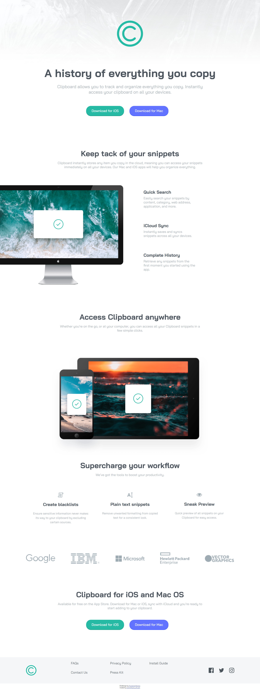
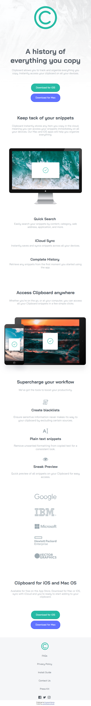

# Frontend Mentor - Clipboard landing page solution

This is a solution to the [Clipboard landing page challenge on Frontend Mentor](https://www.frontendmentor.io/challenges/clipboard-landing-page-5cc9bccd6c4c91111378ecb9). Frontend Mentor challenges help you improve your coding skills by building realistic projects. 

## Table of contents

- [Overview](#overview)
  - [The challenge](#the-challenge)
  - [Screenshot](#screenshot)
  - [Links](#links)
- [My process](#my-process)
  - [Built with](#built-with)
  - [What I learned](#what-i-learned)
  - [Useful resources](#useful-resources)
- [Author](#author)

**Note: Delete this note and update the table of contents based on what sections you keep.**

## Overview

### The challenge

Users should be able to:

- View the optimal layout for the site depending on their device's screen size
- See hover states for all interactive elements on the page

### Screenshot

- Desktop Design
- Resolution above 800px 

- Mobile Design
- Resolution below 800px

### Links

- Solution URL: [GitHub](https://github.com/nefariooo/clipboard-landing-page.git)
- Live Site URL: [Netify](https://magnificentthrush-03-clipboard-page.netlify.app/)

## My process

- Started with HTML, built the structure
- Styled the HTML with CSS each div at a time
- First developed the solution for desktop
- Then, used Media Query to develop the mobile version

### Built with

- Semantic HTML5 markup
- CSS custom properties
- Flexbox
- CSS Grid
- Mobile-first workflow

### What I learned

Learned a lot about media queries and viewport width and height.

### Useful resources

- [Stack Overflow](https://stackoverflow.com/questions) - Best place to find the answer to every question even the  most basics one too.
- [W3 School](https://www.w3schools.com/css/default.asp) - Great website for CSS material.

## Author

- Frontend Mentor - [@magnificent_thrush](https://www.frontendmentor.io/profile/magnificentthrush)
